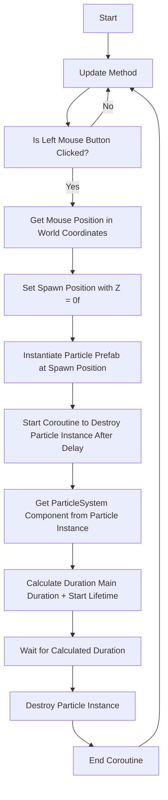

# OnClick Effect Script
## De opdracht
Voor deze taak ga ik een effect en een script maken. Het effect is een kleine "burst" effect en het script zorgt ervoor
dat het effect zich afspeelt op de locatie waar de speler drukt, Vandaar de naam "OnClickEffect". Dit brengt de game een beetje
meer tot leven met wat beweging in de game.

## Flowchart

## Functie beschrijving
Zoals eerder uitgeled bestaat de game uit twee onderdelen. Het effect en het script. Het effect is simpel uitgelegd, een kleine
en korte burst aan particles die kort naar beneden vallen en dan verdwijnen. Veel valt er niet over uit te leggen maar ik had wel
kort problemen met de render priority tussen de UI en het effect. Dit probleem was later makkelijk opgelost met een layer list.

Het script was een beetje meer complex maar ik heb al eens eerder iets dergelijks gemaakt. Ik maak gebruik van een Vector2
om later de positie van de muis te bepalen. Dit gebeurt allemaal binnen een If statement die activeert wanneer de speler "drukt".

    void Update()
    {
        if (Input.GetMouseButtonDown(0))
        {
            mousePos = Camera.main.ScreenToWorldPoint(Input.mousePosition);
            Vector3 spawnPosition = new Vector3(mousePos.x, mousePos.y, 200f);

            GameObject particlesInstance = Instantiate(particlesPrefab, spawnPosition, Quaternion.identity);

            StartCoroutine(DestroyParticlesAfterDelay(particlesInstance));
        }
    }
    
Sinds dit een phone game zou zijn zal dit zelfde systeem ook werken wanneer het op een telefoon gebeurt. Vervolgens bepaald
dit script de locatie van waar de particle spawned als een instance (voor het geval dat de speler veel drukt willen we niet dat
het particle effect zichzelf delete elke keer wanneer een nieuwe spawned). Als laatste zorgt het script er voor dat de instance
verwijderd wordt gebaseerd op de duration van de particle. Dit is ook om te voorkomen dat het effect te snel verwijderd wordt.

    IEnumerator DestroyParticlesAfterDelay(GameObject particlesInstance)
    {
        ParticleSystem particleSystem = particlesInstance.GetComponent<ParticleSystem>();
        float duration = particleSystem.main.duration + particleSystem.main.startLifetime.constantMax;
        yield return new WaitForSeconds(duration);
        Destroy(particlesInstance);
    }

## Problemen
Tijdens de productie had ik kort een issue met dat de particle te snel verwijderd wordt na spawnen. Dit is opgelost door
bijde instances te maken van het particle effect (in plaats van het particle effect aan en uit te zetten op de locaties van)
en door het verwijder gedeelte van het script een delay te geven gebaseerd op de duration van het effect.

Daarnaast had ik het eerder nog over dat ik kort last had van render order issues maar dat was opgelost door een Layer Order te gebruiken.