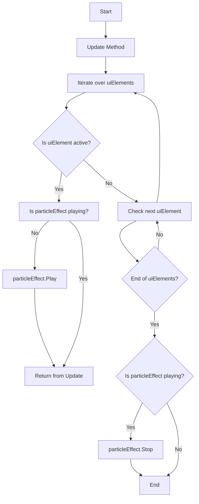

# Quiz Particle Effect Script
## De opdracht
Voor deze taak ga ik aan de slag met een particle effect en een script. Het particle effect moet een rustig en looping effect
zijn wat een beetje in de achtergrond valt tijdens het quiz onderdeel van de game. Dit effect is grotendeels bedoelt voor de
mooi en ook om een beetje beweging te creëren tijdens de momenten waar de game anders stille UI zou zijn. Het script wordt
gebruikt om het effect alleen af te laten spelen wanneer bepaalde onderdelen van de UI actief zijn (specifiek het quiz gedeelte).

## Flowchart 

## Functie Uitleg
Sinds het particle effect heel simpel is sla ik dat over en ga ik meteen over naar het script. Het script is ook redelijk simpel.
Aan het begin zorgen wij er voor dat we natuurlijk het effect kunnen selecteren wat afgespeelt zou moeten worden en een list.
Deze list zal de UI onderdelen bevatten die dicteren wanneer het Particle Effect aan moet gaan (De 3 Quiz UI's).

        foreach (GameObject uiElement in uiElements)
        {
            if (uiElement.activeInHierarchy)
            {
                if (!particleEffect.isPlaying)
                {
                    particleEffect.Play();
                }
                return;
            }
        }

Het script gaat de list langs en kijkt of ééntje actief is. Zo ja zal het effect afspelen en blijven loopen. Als er niks actief
is van de lijst gaat het door naar een simpele if statement die het particle effect uit zet.

        if (particleEffect.isPlaying)
        {
            particleEffect.Stop();
        }

## Problemen
Ik had geen problemen met dit script naast een kort issue met de render order tussen de UI en effecten. Dit is snel opgelost
met een Layer List.