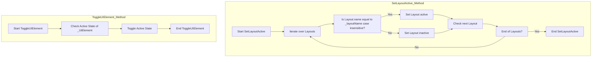

# UI Transition systeem

## De opdracht
Mijn taak is om het UI Transition systeem te maken. Hier wordt er tussen UI elements gewisselt waneer bepaalde acties
gebeuren. Grotendeels zijn deze acties het drukken van knoppen dus dat maakte het erg simpel.

## Flowchart 

## Functie uitleg
Het script bezit twee functies. Functie 1 is voor de main UI Screens en Functie 2 is vooral voor de kleinere menu's die over
de UI Screens heen gaan.

#### Functie 1:
Deze functie zorgt er voor dat de grotere UI elementen nooit tegelijk aan zullen staan 
(De Quiz Screens, Win screen, Settings, Gameplay UI). Dit doet het door alle grote UI onderdelen in een lijstje te zetten en ze
één voor één te name checken. Alle objecten die niet dezelfde naam hebben worden uitgezet. Hierdoor zullen nooit meer dan 1
objecten in die lijst actief zijn.

    public void SetLayoutActive(string _layoutName)
    {
        foreach (GameObject Layout in Layouts)
        {
            if (Layout.name.ToLower() == _layoutName.ToLower()) 
            {
                Layout.SetActive(true);
            }
            if (Layout.name.ToLower() != _layoutName.ToLower())
            {
                Layout.SetActive(false);
            }
        }
     }

#### Functie 2: 
Deze functie zorgt er voor dat de UI met knoppen kan gecontroleerd worden. Terwijl Functie 1 bezig is is dit het
belangrijke onderdeel waar de meeste knoppen aan gekoppeld zullen zijn, en deze belangrijke taak kan allemaal heel kort
samengevat worden. Het is een simpele SetActive functie! Er valt niet veel meer erover te zeggen. Wanneer er een knop gemaakt
wordt koppel je de ToggleUIElement functie en zal het object aan of uit gaan (hangt ervan af of het origineel aan of uit stond).

    public void ToggleUIElement(GameObject _UiElement)
    {
        bool isActive = _UiElement.activeInHierarchy;

        _UiElement.SetActive(!_UiElement.activeInHierarchy);
    }

## Problemen
Ik had eigenlijk geen problemen met dit script. Het enige probleem wat ik had was een misverstand over de opdracht (zie Retrospective Sprint 2). Voor de rest ging dit onderdeel redelijk goed.