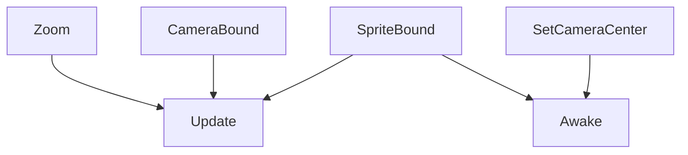

# Camera System Flowchart
#### Functions
- Awake
- Update
- Zoom
- SpriteBound
- CameraBound
- SetCameraCenter

```mermaid
graph TD;
    Zoom-->Update
    SpriteBound-->Update
    CameraBound-->Update
    
    SetCameraCenter-->Awake
    SpriteBound-->Awake
```