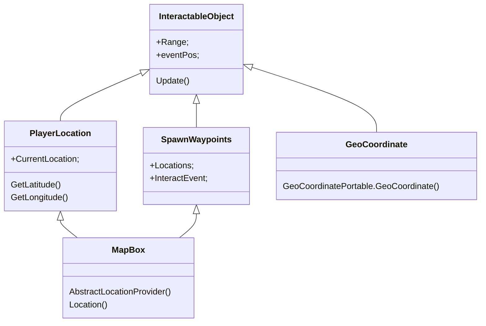
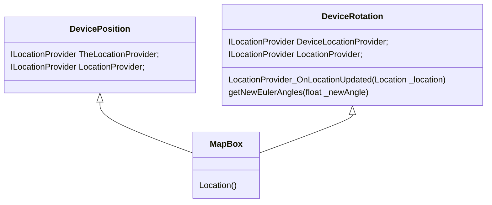

# GPS

This is the chart to visualize how the GPS system for MapBox work with out game.

## Interactable Object

This is how MapBox interacts with my script InteractableObject, making it find the distance between itself and the player location.

## PlayerLocation on GameObject

This is how MapBox gives the player location on a GameObject so it can be visualized through a game object.

