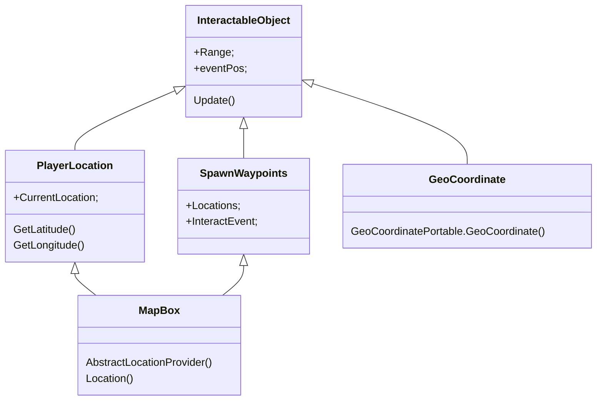
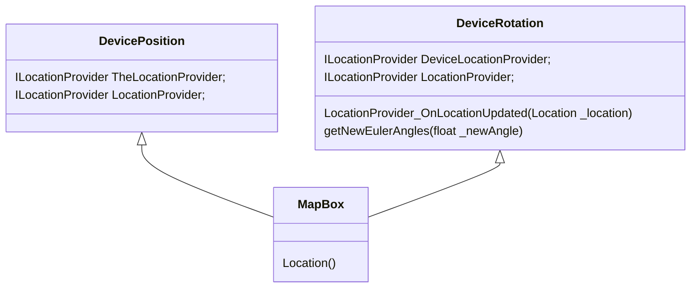

# GPS

Dit is het diagram om te visualiseren hoe het GPS-systeem voor MapBox werkt met ons spel.

## Interactief Object

Dit is hoe MapBox interacteert met mijn script InteractiefObject, waardoor het de afstand tussen zichzelf en de locatie van de speler vindt.

## SpelerLocatie op GameObject

Dit is hoe MapBox de locatie van de speler geeft op een GameObject zodat het gevisualiseerd kan worden via een gameobject.

